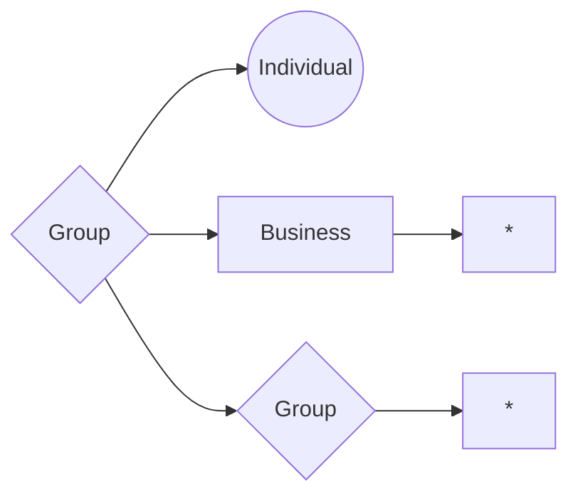
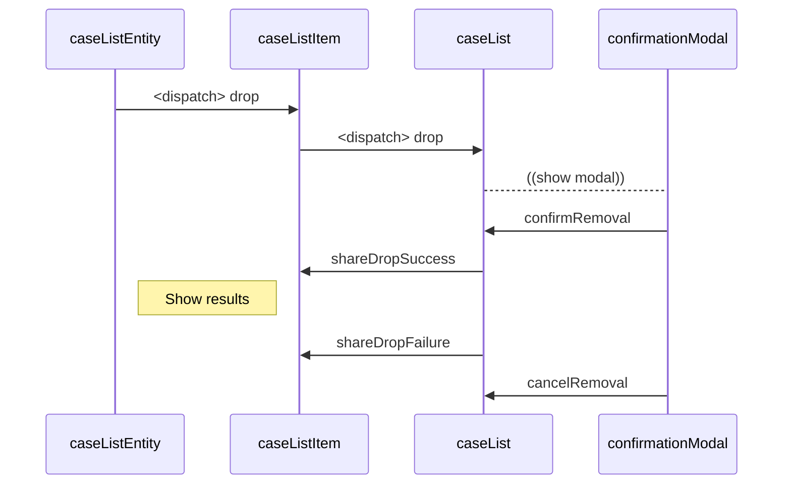

# Zach Caudle's Litify Assessment

## Requirements

1. Must enable My Domain in the org to enable the Lightning Application.
 * `Setup > Administration > Domain Management > My Domain > Configure AND Deploy to Users`
 * `https://developer.salesforce.com/docs/atlas.en-us.lightning.meta/lightning/intro_reqs_my_domain.htm`
2. If you want to run front end tests, need to have sfdx-lwc-jest installed
 * `npm install @salesforce/sfdx-lwc-jest --global`
3. To view properly rendered mermaid in this GitHub README, download the browser extension
 * `https://chrome.google.com/webstore/detail/github-%20-mermaid/goiiopgdnkogdbjmncgedmgpoajilohe?hl=en`

## Sharing

1. Business sharing is managed through a Role Hierarchy structure.

2. Individual is a sibling role to Business which restricts sharing across those roles without explicit sharing records.
  
3. Business and/or Individuals can be added to Groups and we can grant share access to entire groups via the Group record Id just like we can for single User records.

## Caveat(s) 

1. Salesforce does not offer a simple out-of-the-box solution for managing sharing of records with dynamic field entries across multiple users. Because of this, as soon as multiple businesses are working in the same org we run the risk of exposing Case records that we do not want to expose to Businesses we do not want to expose them to. This can be remedied with something like Partner Portal, but I am unsure of how to auto-configure that and didn't think figuring that task out or asking someone to configure an org for Partner Portal was in scope for an assessment.

## Package (v1.1)

If installing the unamanged package, the role and profile metadata will need to be deployed or manually configured in the org that the package is installed in. It is advised you deploy this repo from GitHub instead of installing the package if possible. For manual configuration, see meatadata files for required settings.

https://login.salesforce.com/packaging/installPackage.apexp?p0=04t4T0000011BCr

## Visual Helper(s)

#### Delete Sequence

## Improvements
There is always room for improvement. Given that this is meant as an assessment meant to display my level of understanding of Salesforce as a whole, I did not want to get too far out of scope. However, some areas I know there are room for improvement are:

1. __Security.__ First and foremost. The security model is either not scaleable, or not secure. More thought would need to be put into architecting a proper security model to accommodate multi-business scenarios. More manual configuration could be done to accommodate for now through things like sharing settings, but that seemed out of scope for the assessment. You can also share records indiscriminately with no real checks happening. 
2. __Efficiency.__ There are places I believe things could be more efficient, like the way things are loaded. In some cases, decisions were made to do things differently than I normally would in an effort to display an ability to work with the framework. An example would be the way entities are added and removed, which is currently done the way it is to display use of multi-component designs.
3. __Edge Cases.__ There are plenty of holes around the edge and places that are not thoroughly tested.
4. __Testing.__ Code coverage of the Apex controller is right around 80% while the jest tests were written just to show an understsanding of a front-end testing framework.
5. __Custom Labels.__ Right now strings are hard coded in. That is bad for a number of reasons, from brandability to internationlization. While it was easy enough to accommodate through a custom label metadata file, it didn't seem entirely necessary for the assessment.

## Bugs
As an assessment this is not meant to be maintained. However, if you recognize major bugs please feel free to reach out.